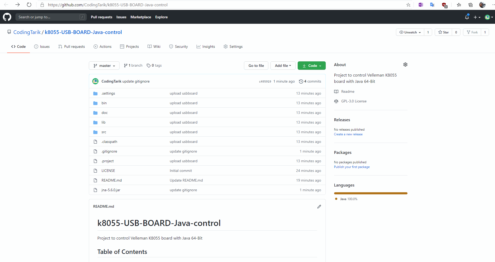

# k8055-USB-BOARD-Java-control
Project to control Velleman K8055 board with Java 64-Bit

## Table of Contents
  - [Setup](#setup)
  - [Download](#Download)
  - [Stats](#stats)
  - [Clone](#clone)
  - [License](#License)
## Setup


## Download
[Click here to download](https://github.com/CodingTarik/k8055-USB-BOARD-Java-control/archive/1.0.zip)

## Stats


## Clone
> You need 'Java 1.8 or higher' for this
> You need Java 64-Bit

- Enter the following command
```shell
$ git clone https://github.com/CodingTarik/k8055-USB-BOARD-Java-control.git
```
## License

